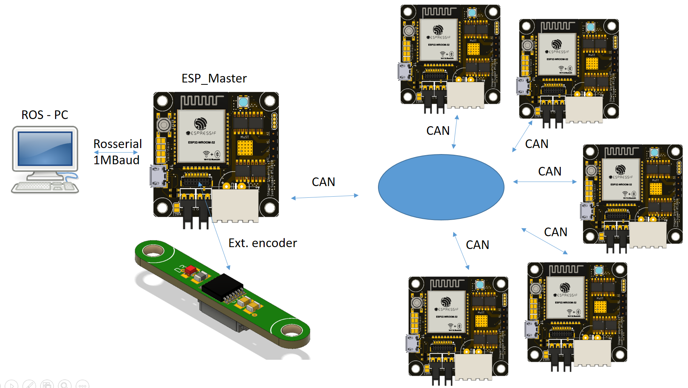

Author: Sven Suppelt, Felix Herbst		Date: 09.05.2023

# HELENE - electronics for the low cost 6DOF robot
This repository is responsible for the electronics for the Helene robotarm. Included are the PCBs and the code to run on these. 

The robot arm has a motor control board on each of its 6 axes. The board of the lowest axis, the 1st axis, acts as ROS Serial Slave. All other axes receive their control data from the 1st axis via CAN. 

A single motor control board consists of a microcontroller (ESP32), a stepper motor driver (TMC5160), a magnetic encoder to determine the current position of the robot arm (AS5048) and a CAN transceiver. 
The 1st axis is equipped with an external magnetic encoder due to lack of space. All other axes have enough space so that the board can be mounted directly above the required magnet. 

# Folder structure
The boards are located in the folder "pcb". Here you will find the board for the external encoder and the motor control board. The source code for the boards can be found in the "code" folder. Stored there are the PlatformIO projects for the ROS Serial Slave (Helene_ESP_Master) and the other boards connected via CAN (Helene_ESP_Slave).
In the pcb folder there are two additional optional boards, the end effector board and a H-bridge with voltage converter. The end effector board has its own ESP32 with an ADC for measuring load cells. Furthermore, two outputs for servos are provided, so that grippers with integrated force measurement can be realized. The H-bridge is connected via the expansion ports on the boards and can drive motors up to 3A at 5V. It does not have its own microcontroller.

# System structure of the robot arm
 

# Available Serial Commands
Each slave is equipped with the possibility of serial communication. Via this interface the calibration value of each axis can be read and set and status information can be read out. It is absolutely necessary to calibrate each axis individually!
The following commands are available:

long form | short form | description
-------- | -------- | --------
*IDN? | IDN? | Prints identification
HELP? | HELP | Prints a help screen (not yet implemented)
CALSINGLEJOINT [joint ID] | CAJO [joint ID] | starts the calibration process of given joint. Instructions will be printed after that command!
SETNULL [0,1] | SENU [0,1] | globally enables (1) or disables (0) the Nullpunktfahrt at startup
GETCALVALUE [joint ID] | GECA [joint ID] | Prints the current saved calibration value of given joint
SETCALVALUE [joint ID] | SECA [joint ID] | Sets the current saved calibration value of given joint. Instructions are printed after that command!
GETACTUAL [joint ID] | GEAC [joint ID] | Prints the actual angle of given joint. The actual angle is: Raw_Angle - Calibration_Value
GETRAW [joint ID] | GERA [joint ID] | Prints the raw angle of given joint
DONULL [joint ID] | DONU [joint ID] | The given joint will do a Nullpunktfahrt
OFFANDNULL [joint ID] | OFNU [joint ID] | Sets a offset value on the current calibration value. After that a Nullpunktfahrt is initiated. Instructions are printed out!
DIAG | DIA | Prints out diagnose data

# Installation instructions

1. Gather all materials.
You will need 6 motor control boards and 1 external encoder board.
2. Do the wiring. 
You will have to run CAN and power to each motor control board. The boards are daisy-chainable!
3. Program the boards.
"Helene_ESP_Master" should be uploaded to the board in joint 1. This board is configured with rosserial so that it communicates directly with ROS.
"Helene_ESP_Slave" should be uploaded to the boards in joint 2-6. These boards talk via CAN to the board in Joint 1 and thus receive their control information. With each individual board it is possible to calibrate the robot arm. 
After programming, each board should slowly blink red!
4. Set the SMD-Jumpers.
For joints 1 and 6 the CAN terminating resistor must be set by bridging the SMD solder bridge next to the CAN sockets.
Additionally the Joint-ID must be set for each board. For this purpose four SMD pads are provided next to the USB socket. By bridging these pads the ID can be set. The data format is binary with the most significant bit first. For example the joint 5: 0 1 0 1 must be set. 
5. Calibrate the zero position
6. Enable Nullpunktfahrt globally

# Video installation instructions

The installation process is also explained in the following video.

Starting at 0:09 the installation of the electronics is explained. From 6:21 on the calibration is shown.
